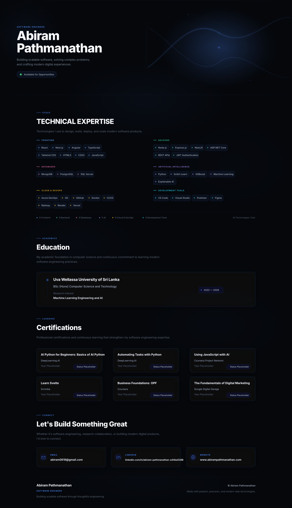

# Engineering Portfolio

<!-- [GitHub Actions: Daily profile update trigger] -->

## 🏛️ Core Architecture & Systems

Building scalable, maintainable, and high-performance software requires robust architectural patterns. My approach to engineering emphasizes clean code, modular design, and robust system architecture. Whether developing real-time analytics platforms or complex inventory systems, I focus on Service Layer patterns, comprehensive audit trails, and efficient database designs to ensure enterprise-grade reliability.

## 🚀 Featured Engineering Initiatives

Here are a few of my most notable projects that demonstrate my ability to architect and deliver full-stack applications:

### 1. [AlloraAI](https://github.com/Abiram19/AlloraAI-) 
An all-in-one AI-powered web application offering a suite of intelligent tools, including an AI Article Writer, Blog Title Generator, AI Image Generator, Background & Object Removal, and Resume Reviewer. Built to simplify creativity and content generation through modern AI technology.
* **Tech Stack:** JavaScript, AI Integrations, Web APIs

### 2. [Smart Pharmacy Management System](https://github.com/Abiram19/Project-02-Frontend)(https://github.com/Abiram19/Project-02-Backend)
A full-stack pharmacy management platform with a customer dashboard, order management workflow, integrated payment processing, and well-structured REST APIs for inventory and prescription handling.
* **Tech Stack:** NextJS, ExpressJS, NodeJS, TypeScript, MongoDB, Tailwind CSS

### 3. [Next.js Engineering Portfolio](https://github.com/Abiram19/portfolio-site)
A high-performance personal portfolio website built to showcase software engineering projects, academic research, and technical certifications. Designed with smooth micro-interactions and accessibility in mind.
* **Tech Stack:** TypeScript, Next.js, Framer Motion

### 4. [Automobile Service Management System](https://github.com/Abiram19/Project01-Frontend)(https://github.com/Abiram19/Project01-Backend)
End-to-end service management system for auto workshops featuring online service booking, an admin dashboard, comprehensive customer management, and real-time vehicle service status tracking.
* **Tech Stack:** ReactJS, PHP, MySQL, Bootstrap

### 5. [Inventory Management System](https://github.com/Abiram19/Inventory-Management)
A comprehensive enterprise inventory system for tracking stock items and transactions with complete audit trails, real-time search, and low-stock alerts. Features 18+ measurement units and bulk operations. Implements the Service Layer pattern and secure authentication.
* **Tech Stack:** PHP (Laravel 11), Vue 3, Inertia.js SSR, Tailwind CSS, Laravel Breeze

### 6. [ComfortIQ Weather Analytics](https://github.com/Abiram19/ComfortIQ-weather-comfort-analytics-app)
A performant Weather Comfort Dashboard that calculates and displays comfort scoring. Features robust caching mechanisms and user authentication for personalized analytics.
* **Tech Stack:** JavaScript, External APIs, Caching Strategies

### 7. [Online Food Ordering System](https://github.com/Abiram19/online-food-ordering-system)
A traditional monolithic web application handling user orders, food delivery logistics, and restaurant menus.
* **Tech Stack:** Java, JSP, HTML, CSS

## ⚡ Technical Competencies

I leverage a modern technology stack to design, build, deploy, and scale robust software products:

### **Frontend Engineering**
`React` `Next.js` `Angular` `TypeScript` `JavaScript` `Tailwind CSS` `HTML5` `CSS3`

### **Backend Engineering**
`Node.js` `Express.js` `NestJS` `ASP.NET Core` `REST APIs` `JWT Authentication`

### **Databases**
`MongoDB` `PostgreSQL` `SQL Server`

### **AI & Machine Learning**
`Python` `Scikit-Learn` `XGBoost` `Machine Learning` `Explainable AI`

### **DevOps & Cloud**
`Azure DevOps` `Docker` `Git` `GitHub` `CI/CD` `Vercel` `Railway` `Render`

### **Development Tools**
`VS Code` `Visual Studio` `Postman` `Figma`

## 🌍 Open Source Impact

I actively build and maintain open-source software, focusing on full-stack applications, developer tools, and AI integrations. I am deeply interested in Machine Learning Engineering, cloud deployments, and improving system architectures. My GitHub activity reflects a commitment to continuous learning and sharing modern web technologies with the broader engineering community.

## ✍️ Publications & Writing

*Currently drafting a series of technical articles focusing on modern software engineering practices. Upcoming topics include:*
- **Architecting Scalable Systems with Next.js and NestJS**
- **Explainable AI: Bridging the Gap Between Machine Learning and Business Logic**
- **Optimizing Frontend Performance: Framer Motion and SSR**

## 📬 Contact

Let's build something great. Whether it's software engineering, research collaboration, or building modern digital products, I'd love to connect:

- **Email:** [abiram0619@gmail.com](mailto:abiram0619@gmail.com)
- **LinkedIn:** [abiram-pathmanathan](https://linkedin.com/in/abiram-pathmanathan-a44ba5268)
- **Website:** [abirampathmanathan.com](https://www.abirampathmanathan.com)
- **Phone:** [+94773351906]
